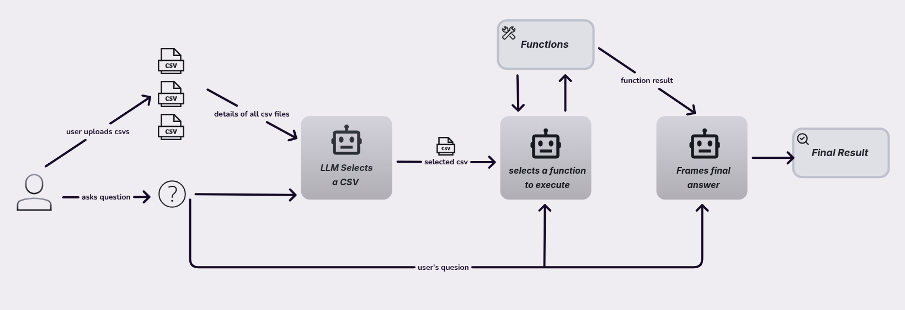

# Multi-CSV Agent
A visual overview of the agent flow:



A powerful data analysis tool that uses AI to analyze multiple CSV files through natural language queries. Built with Streamlit and OpenAI's function calling capabilities.

## Features

- **Multi-CSV Support**: Upload and analyze multiple CSV files simultaneously
- **Natural Language Queries**: Ask questions about your data in plain English
- **Advanced Analytics**: Perform statistical analysis, create visualizations, and detect patterns
- **AI-Powered**: Uses OpenAI's function calling to intelligently select and execute analysis functions
- **Interactive Visualizations**: Generate and download charts, plots, and heatmaps
- **Comprehensive Logging**: Detailed logging for debugging and monitoring

## Installation

1. **Clone the repository**:
   ```bash
   git clone <repository-url>
   cd agentic_data_analyser
   ```

2. **Install dependencies**:
   ```bash
   pip install -r requirements.txt
   ```

3. **Set up environment variables**:
   Create a `.env` file in the root directory:
   ```env
   GEMINI_API_KEY=your_api_key_here
   MODEL=name_of_the_model
   BASE_URL=your_custom_base_url_optional
   ```

## Usage

1. **Run the application**:
   ```bash
   streamlit run app.py
   ```

2. **Upload CSV files**:
   - Use the file uploader in the sidebar
   - Support for multiple CSV files
   - Files are automatically analyzed and categorized

3. **Ask questions**:
   - Enter natural language queries about your data
   - Examples:
     - "Show me a histogram of the age column"
     - "Create a correlation heatmap for numeric columns"
     - "Perform PCA analysis on the dataset"
     - "Find outliers in the price column"

## Analysis Capabilities

### Basic Analysis
- Dataset summary and statistics
- Column type detection (numeric, categorical, datetime)
- Missing data analysis
- Data distribution analysis

### Visualizations
- Histograms and boxplots
- Scatter plots and line charts
- Correlation heatmaps
- Bar charts for categorical data
- Missing data visualizations
- Cross-tabulation heatmaps

### Statistical Analysis
- Principal Component Analysis (PCA)
- K-means clustering
- Linear regression
- Outlier detection (IQR and Z-score methods)
- Data filtering and subset analysis

## Configuration

### Function Definitions
All available analysis functions are defined in `src/config/constants.py`:
- Function descriptions and parameters
- Default values and limits
- Analysis constraints

### Prompts and Messages
System prompts and user messages are stored in `src/config/prompts.py`:
- System instructions for different components
- Error and success messages
- UI text and placeholders

### Logging
Comprehensive logging is implemented in `src/utils/logger.py`:
- Separate loggers for different components
- File and console logging
- Configurable log levels

## Architecture

### Modular Design
The application is organized into specialized modules:

1. **Agents** (`src/agents/`): AI agent implementations
2. **Analyzers** (`src/analyzers/`): Data analysis functionality
3. **Config** (`src/config/`): Configuration and constants
4. **UI** (`src/ui/`): Streamlit UI components
5. **Utils** (`src/utils/`): Utility functions and logging

### Analyzer Hierarchy
- **MainCSVAnalyzer**: Combines all specialized analyzers
- **CoreAnalyzer**: Basic data analysis and statistics
- **VisualizationAnalyzer**: Chart and plot generation
- **StatisticalAnalyzer**: Advanced statistical operations


